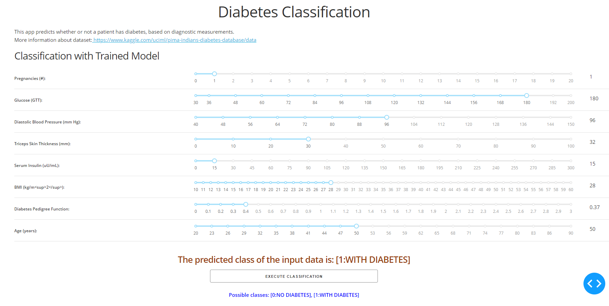
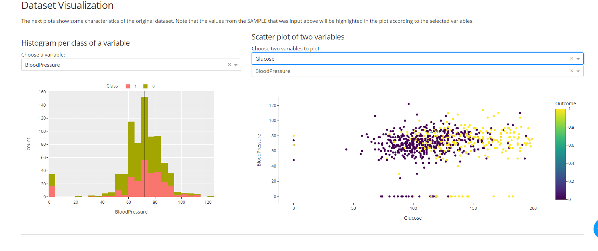

In this project I predicted whether the person has diabetes using Support Vector Classifier (SVC) and GridSearchCV in Scikit Learn. I achieved an acurracy of 77% and then I have deployed the model using Plotly Dash. I have found the dash files online and have made changes according to my need.

